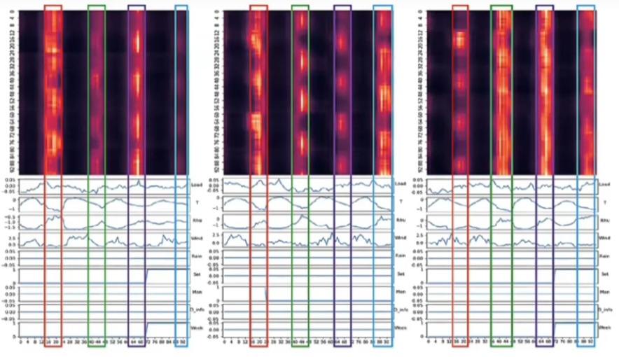

# 1 说明
这个项目用于对光伏数据进行探索，预测，计划使用下列模型作为对比：
- Transformer
- Informer
- Autoformer
- FEDformer
- Pyraformer
- PatchTST
- FFTransformer

后续还可进一步完善！
可以考虑加入的模型：
- MICN


## 数据部分
使用两个数据集
- 一个是澳大利亚的数据集，分辨率为10min的一年数据，共51984条
- 第二个是中国河北的数据集，不到一年，分辨率为15min


# 2 如何添加新的模型
## 基本步骤
分以下步骤进行：
- 首先，把自己写的模型文件（例如`example_models.py`）放到 **models** 文件夹下，如果该模型还有一些子层的实现代码，将其放到 **layers** 文件夹并在模型文件中导入这些子层；检查这些导入的文件的import语句是否可用，不可用时把原代码的部分依赖引入。
- 其次，修改 **exp** 文件夹下的 `exp_main.py` ，该文件是模型的训练和评估的地方，也就是使用模型的地方。
  - 需要添加一句 `from models import example_models.py` 来 **导入模型**。
  - 需要在 `_build_model()` 里面的 model_dict 字典中添加当前新增 **模型的键值对**。
  - 对于某些特殊模型，还需要在 `train()` 方法设置相应的参数！
- 最后，修改 `run_longExp.py` 里面的参数传递部分，可以添加一些和当前模型相关的参数
  - 这些参数会传给 exp_main.py ，然后传给要调用方法的init()方法。
  - 因此在编写模型文件时需要先想好需要使用到的参数，写在init()里面。对于已有的模型进行整合时如何确定其使用的参数？
    - 1 首先，在模型文件（例如 `FFTransformer.py`） 里面找到Model()类的 `__init__()` 方法，查看其使用的超参数，将其记录下来。
    - 2 然后，对照 `run.py` 里面的超参数，将两者不相同的超参数作为当前模型的超参数，在 `run.py` 里面隔开一个位置专门放置该模型对应的超参数。
    - 3 注意保持一些公共超参数的名称一致，例如 `n_model,n_head` 之类的共用参数。


## 不同模型的不同输入(模型整合的前提)
对于不同的模型具有不同的输入，需要为其设定判断条件：
- 默认的应该是基于Informer那种的模型输入有五个：
  - batch_x(32,96,6), batch_x_mark(32,96,5), dec_inp(32,144,6), batch_y_mark(32,144,5)，其中的batch_y_mark对应atten_mask，但这个参数貌似没有被使用，所以真正用到的就四个。
  - `outputs = self.model(batch_x, batch_x_mark, dec_inp, batch_y_mark, batch_y)`
  - 这种模型对应标准Transformer的编解码结构，其输入包含编码器和解码器的输入。
- 对于像patchTST（仅有硬位置编码，没有时间编码，且硬位置编码应该是对patch的编码）和Linear以及LSTM(LSTM分两种，一种是普通的，另一种是编解码器结构的，这里仅使用编解码结构的LSTM)这种，没有时间编码，没有解码器输入或解码器输入？？
  - batch_x(32,96,6)
  - 对于linear或者LSTM直接就能根据batch_x获取结果
  - 对于PatchTST
- 对于像pyraformer这种分两种情况：
  - 解码器是MPL时，其仅需要：batch_x(32,96,6), batch_x_mark(32,96,5)，解码器为MPL时仅需要把编码器的输出直接作为MLP的输入得到最后的输出即可。
  - 解码器是类似于Transformer的结构时，需要： x_enc, x_mark_enc, x_dec, x_mark_dec


## 模型整合记录
### FFTransformer.py 使用到的参数
使用的自注意力是LogSparseAttention
```
# data loader 
configs.freq                  # freq for time features encoding, options

# forecasting task
configs.seq_len         
configs.label_len     
configs.pred_len 
configs.enc_in
configs.dec_inc
configs.c_out

# model define
configs.d_model
configs.n_heads
configs.e_layers            # number of encoder layers
configs.d_layers            # number of decoder layers
configs.d_ff                # dimension of fcn
configs.factor              # attn factor（ProbAttention的一个参数）
configs.dropout
configs.embed               # time features encoding, options:[timeF, fixed, learned]
configs.activation          
configs.output_attention    # whether to output attention in ecoder
# 下面的参数都是FFTransformer独有的（其中的kernel_size和PatchTST重合了，建议将其设为默认值3）
configs.qk_ker              # Key/Query convolution kernel length for LogSparse Transformer
configs.v_conv              # Weather to apply ConvAttn for values (in addition to K/Q for LogSparseAttn
configs.top_keys            # eather to find top keys instead of queries in Informer
configs.kernel_size         # Kernel size for the 1DConv value embedding
configs.norm_out            # Whether to apply laynorm to outputs of Enc or Dec in FFTransformer
configs.num_decomp          # Number of wavelet decompositions for FFTransformer
configs.mlp_out             # Whether to apply MLP to GNN outputs
```


### LSTM.py 使用到的参数： 
- 由于LSTM有 `mixed_teacher_forcing`，所以要给模型传递这个参数，具体来说给模型传递这个参数时需要在 模型定义的位置（例如Informer.py） 的forward方法传入参数时添加一个 `, **_` ，使得对于非LSTM模型不会因为传入参数增多而报错。**后续新增模型时都需要添加这个参数防止报错！**
- 对于mixed_teacher_forcing，在一开始设置一个teacher_forcing_ratio，然后每个训练的epoch减小这个值
- 超参数仅有一个：`train_strat_lstm` 用于控制是否使用mixed_teacher_forcing
- 只需要改train()方法，其他的不用修改。


### persistence模型
persistence模型比较特殊：
- FFTransformer给出的代码是使用 t 时刻的值作为 t+1 时刻的值，对于预测未来24个值时是把这24个值全部设为t时刻（最后一个已知时刻）的值，导致未来24个值完全相同！这种方式对于短期预测可能还有点用，但是对于长期预测太过不理想！
- 而如果采用 `48-h persistence` 的话，这里的 48-h 是指使用过去的倒数第二天的数据作为未来一天的数据，也有一些问题：
  - 作者说之所以采用 `48-h persistence` 而不是 `24-h persistence` 是因为当前只能获取到倒数第二天的数据而不是最后一天的数据，如果是真的的话，那么我的其他所有模型也得使用倒数第二天的数据预测未来一天的数据。这种操作会导致**丢失时间连续性**，而且重新划分数据集也是一个技术问题！
  - 其次，如何在批代码中实现这个功能？是在数据划分阶段把sel_len部分设置为(t-48,t-24),把pred_len设为(t+1,t+24)? 还是说按原本的划分，在使用数据时使用batch_x的 t-48 部分（这要求seq_len的长度至少包含两天的数据）？
- 对于实用中长期预测，时间分辨率为15min，一天为96步
  - 在数据划分阶段划分可行，但需要动原本的代码结构，而且会破坏时间连续性（只要获取不到最后一天的数据都会产生时间不连续）！
  - 这么看只能忽略这个时间段了，但需要注意预测时不能只预测未来96步，因为电网上报时有个延迟，大概**需要提前1.5天预测**!
  - 如果想让persistence在batch里面实现，那么batch里面seq_len的长度需要扩充
    - 对于预测长度pred_len=96中的第i个点，且 `persistence-24h`，其persistence值为 `i-96`，这要求seq_len长度至少为96；
    - 对于 pred_len>96 的情况（对于实用日前预测可以说是必定出现！）会出现 **预测长度中出现两天的数据**，使得pred_len后面部分的数据可能会等于pred_len前面的数据！
    - 对于 pred_len>seq_len 的情况，只要确保seq_len>96即可，pred_len里面的值就是seq_len的重复

总结：batch里面可以使用persistence，对于预测长度pred_len=96中的第i个点，且 `persistence-24h`，其persistence值为 `i-96`

**persistence的移入**：
- 首先在 models 里面把 `persistence.py` 创建或移入，这个文件主要是persistence模型的实现
- 然后在 `exp_main.py` 中导入该模型: `from models import persistence`
- 接下来是使用模型，在 `_build_model(self)`中的 model_dict 添加persistence模型
- 然后是在模型的 `train()` 里面添加一些代码，具体参考 FFTransformer。

### FEDFormer模型迁入


 

# 3 探索
## 注意力可视化
- 之前看的一个负载预测的论文中的Transformer注意力的可视化，意思是在用电较多的时间段（下午3点到11点）其注意力呈现带状，带状注意力和用电高峰重合。这算是他的可视化解释。
- 然而这种解释是在作者划分数据集时使用过去四天的数据预测未来一天的数据，窗口移动步长为1天，这会导致数据集变小，对我这本就不多的数据来说是雪上加霜啊！
- 按我目前这个一个步长的窗口间隔，很难判断当前的窗口对应的时间，进而把特定的attention map与其对应的时间段对应起来，这是一个问题！
- 关于训练不同阶段的可视化也可以尝试! 
- 如果真的想使用attention map的可视化，需要先收集一下别人的关于注意力图的解释，然后跟着学一学！

**注意力可视化的步骤**：
- 代码本身带有返回attention的语句，只是默认只接受output而忽略atten，所以需要修改一些代码；
- 目前主要是使用测试集的数据来进行可视化，也就是先把模型训练好，然后加载训练好的模型在测试集的一个批次的数据上进行可视化，需要设置以下参数：
  - `istrain = 0`
  - `batch_size = 1`
  - `output_attention = True`
  - 注意还需要修改 `model_id`，因为读取的模型所在的路径是根据传入的参数动态生成的！
- 除参数外，还需要在模型输出结果位置添加对atten的接收，并将其保存到指定路径。

## 结构探索


# 4 已有模型笔记
## FFTransformer
1 其MDWD是怎么分解的，分解后的结果是什么，分解后的值输入到哪里？

1 文章使用了哪些位置编码？
- 对于频率：self.enc_embeddingF 和 self.dec_embeddingF
  - 文章貌似没有使用位置编码！编解码器都没有使用位置编码（包括绝对位置编码和时间位置编码）
  - 仅仅是对特征值使用了一维卷积来映射到512维的空间中（使用kaiming对一维卷积的权重初始化）
- 对于趋势：enc_embeddingT 和 dec_embeddingT
  - 文章首先使用值嵌入对特征进行一维卷积到512的空间，然后使用了位置编码；
  - 没有使用绝对的位置编码，但使用了时间位置编码（线性层）


## FEDformer
1 FEB-F是通过设置一个可学习矩阵进行学习频域信息的，那么FEB-W模块是如何学习的？
- 首先说一下Transformer如何学习，输入的x经过三个线性映射层变为Q，K和V，这三个线性层的权值就是自注意力学习的参数！
- 其次是FEB-F的学习，使用一个可学习权值7


# TODO
1. ~~修改 data_loader.py 的数据，添加对光伏数据的数据处理类；删除其他的数据集处理代码；~~   
2. ~~尝试添加新的模型FFTransformer，并记录过程（注意处理自注意力和PatchTST的区别）；~~
3. 运行模型获取结果；
4. 搭建自己的模型的框架；
5. ~~添加训练时的损失函数变化图的绘制~~
6. 添加模型评价的一些指标，如技能评分（同时~~添加naive model~~）
7. ~~添加attention map可视化代码~~


# 运行脚本
定位到当前项目，然后运行类似于下面的命令：
```shell
sh ./scripts/Transformer.sh
```


